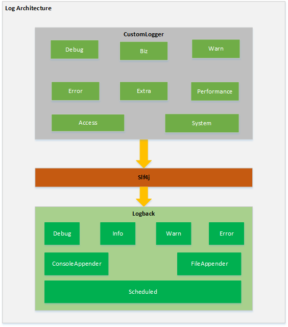
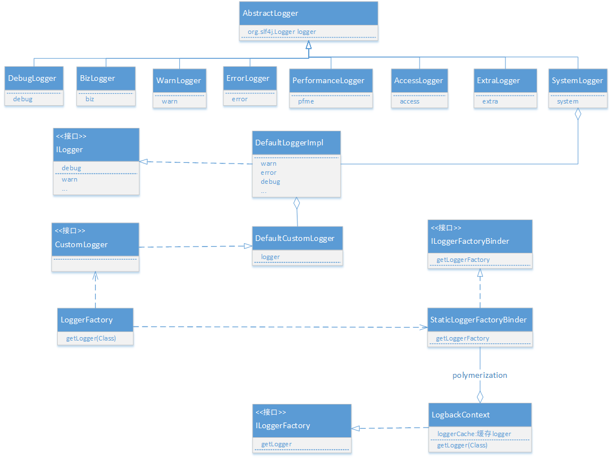

# hbfintech-logger
## 架构图

## 类图

## 历史版本
### 2.1.0
    添加spring boot autoconfig
### 2.0.2
    修复异常日志不全的BUG
### 1.0.8
    添加访问日志
    tomcat最低要求tomcat8
    JDK最低需求java8
### 1.0.7
-  移除废弃代码
-  代码最低支持版本Java1.7   
-  代码遵循Sonar java_hbfintech规则

### 1.0.3-RELEASE

    添加接口日志常量 
    com.hbfintech.logger.constants.LoggingConstants.REQUEST_SUCCESS             请求成功
    com.hbfintech.logger.constants.LoggingConstants.REQUEST_ERROR               请求失败(合作方系统错误)
    com.hbfintech.logger.constants.LoggingConstants.REQUEST_TIMEOUT             请求超时(网络问题、合作方系统宕机、业务处理超时)
    com.hbfintech.logger.constants.LoggingConstants.REQUEST_CODE_UNKONW         合作方未知异常->错误码未知
    com.hbfintech.logger.constants.LoggingConstants.REQUEST_SYSTEM_INNER_ERROR  系统内部异常->系统内部无法处理异常

### 1.0.0

-  添加业务日志类型

